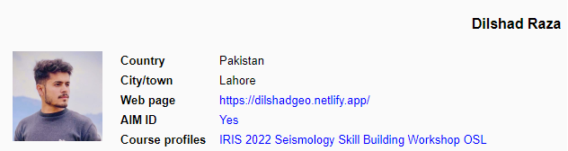

# **Seismology Skill Building Workshop for Undergraduates**
------- -------- ------- ------- ------- ------ ----------
The **IRIS Education and Outreach program** and **Miami University** are offering **seismology skill building workshop** for any undergraduate (e.g., computer Science, geophysics, geology, math, physics) student seeking to build scientific computing skills while working with seismic data. The goals of this workshop are to increase students'...
- interest in taking additional course work in seismology and scientific computing,
- self-efficacy in using seismic data, and
- competitiveness in the graduate school or summer REU application process.

### **Timing:**
Summer. Every other week for 12 weeks, a module with ~6 assignments was released to students. On average students invest ~5-6 hours into the webinars and assignments. The workshop will run from June 13th, 2022 through September 4th, 2022

### **Key Course Elements:**
A tailored Linux virtual machine, regular webinars (recorded for asynchrous use), a Slack workspace for peer-to-peer, and student-to-staff discussions), tutorial-style active e-learning assignments embedded in a learning managment system, and an optional final project. The workshop was delivered by two course faculty and supported by two seismology graduate student teaching assistants.

### **Funding:**
Additional funding has been provided for this workshop and research related to its pedigogy by the National Science Foundation.

## **Course Content:**
The course introduced seismological and computational concepts while also emphasizing how a seismologist might think about and approach the dataset or methodology at hand. Assignments were designed to build skills with Linux, GMT, SAC, webservices, seismic network processing, Python, ObsPy, and Jupyter notebooks. Additionally, research skills and topics likely to increase students' success were introduced including: 
- how to read scientific literature
- productive coding habits
- seeking the mentoring you need
- incorporating workshop learning into a resume or graduate school application
- networking and developing elevator speeches.

### **Module 1 - Introduction to scientific computing and coding strategies**
 Introduction to Linux command line, shell scripting, and basic plot generation with Generic Mapping Tools (GMT) that enables exploration of earthquake patterns in space, time, and magnitude, and Earth’s internal structure based on seismic wave travel times.

- Linux Tutorial 1: Basics
- Linux Tutorial 2: Next Steps
- Linux Tutorial 3: Text Editing and Shell Scripts
- Linux Tutorial 4: Text processing with awk
- Linux Tutorial 5: GMT XY Plot
- Linux Tutorial 6: GMT Maps
- Linux Tutorial 7: Seismic Wave Travel Times and Ray Paths with TauP

### **Module 2 - SAC, Seismic recordings, and seismograms**
Introduction to Seismic Analysis Code (SAC) for viewing seismograms as both waveforms and spectrograms, and conducting time series analysis, filtering, and component rotation that enables detection, characterization, and interpretation of seismic wave patterns.

- SAC Tutorial 1: Introduction and Reading/Writing Data Files
- SAC Tutorial 2: Obtaining Seismic Data
- SAC Tutorial 3: Fourier Analysis and Filtering
- SAC Tutorial 4: Body Waves
- SAC Tutorial 5: Earthquake Source Directivity
- SAC Tutorial 6: Convolution and Cross-Correlation.

### **Module 3 - Data access and IRIS Data Request Tools**
Use the myriad of IRIS waveform, metadata, and earthquake catalog request tools (e.g. web services, earthquake browser, Wilbur, MUSTANG, etc.) to check data availability and access data that enables exploration of relationships between earthquakes and plate boundaries and earthquake frequency and magnitude.

- IRIS DMC Tutorial 1: IRIS Earthquake Browser
- IRIS DMC Tutorial 2: GMAP, MDA, and MUSTANG Databrowser
- IRIS DMC Tutorial 3: Web Services
- IRIS DMC Tutorial 4: dataselect Web Service and Filtering Seismograms
- IRIS DMC Tutorial 5: Surface Wave Seismograms and Speeds
- IRIS DMC Tutorial 6: Fetch Scripts for Web Service Requests

### **Module 4 - Event and waveform databases**
Use various methods to visualize collections of seismic waveforms for a given earthquake and software for forward modeling and inversion that enables both estimation of subsurface velocity structures and earthquake hypocenter and fault plane solutions.

- Network Tutorial 1: Local Seismogram Viewer and the Moho
- Network Tutorial 2: Global Seismogram Viewer and Forward Modeling
- Network Tutorial 3: Focal Mechanisms
- Network Tutorial 4: Earthquake Location Principles
- Network Tutorial 5: Earthquake Location with SAC and a Script.

### **Module 5 - Python, ObsPy and Applications in Seismology**
Introduction to Python and commonly used libraries (e.g., NumPy, Matplotlib, Pandas, and ObsPy) for retrieving, processing, and plotting of data tables and times series that enables rapid scientific analysis of earthquake catalogs and seismic waveforms.

- Python Tutorial 1: Introduction and Aftershock Rates
- Python Tutorial 2: NumPy and Matplotlib modules
- Python Tutorial 3: Pandas and an Earthquake Cross-Section
- Python Tutorial 4: Introduction to ObsPy
- Python Tutorial 5: ObsPy and the 2018 Kilauea Eruption
- Python Tutorial 6: ObsPy and Cross Correlation

### **Module 6 - Jupyter notebooks**
Use existing and create new Jupyter Notebooks with Python to explain and share code with other scientists that enables advanced seismogram processing including removing an instrument response, calculating a spectrogram, and estimating temporal changes in cultural noise.

- Jupyter Tutorial 1: Interacting with an Online Jupyter Notebook
- Jupyter Tutorial 2: Creating Your Own Jupyter Notebook
- Jupyter Tutorial 3: Spectrograms
- Jupyter Tutorial 4: GitHub and Removing the Instrument Response
- Jupyter Tutorial 5: Seismic Noise and Quieting During COVID19

### **Final Assignment (Optional)** 
The final assignment for the Skill Building Workshop is to develop a Jupyter Notebook*  showcasing what students have learned from this course!
[Final Project Descripotion and Rubric 2021](https://www.iris.edu/files/programs/education_and_outreach/2021_Final_Assign_Rubric_V3.pdf)

**In addition, special webinars (possible topics below) may be interspersed**
- Networking
- The graduate school process
- Careers and career paths

## **Instructor(s) Information:**
Instructor: **Dr. Michael Brudzinski**, Professor – Miami University\
Office Telephone: 513-529-9758\
E-mail: brudzimr@miamioh.edu

Teaching Assistant: **Dr. Shannon Fasola**, Post-Doc – Miami University\
E-mail: fasolasl@miamioh.edu

Teaching Assistant: **Gillian Goldhagen**, PhD Student – University of California, Riverside\
E-mail: ggold002@ucr.edu

Instructor: **Michael Hubenthal**, Senior Education Specialist – IRIS\
Office Telephone: 607-777-4612\
E-mail: hubenth@iris.edu

Teaching Assistant: **Yuri Tamama**, PhD Student – California Institute of Technology\
E-mail: ytamama@caltech.edu

## **Note:**
This repository Contains the tutorials for the workshop which, I, Dilshad Raza, has completed myself and creating this repo for Educational purposes. To review the topics and details for my personal future usage.

### **Participant:**
Dilshad Raza\
E-mail: dilshad.geologist@gmail.com\

